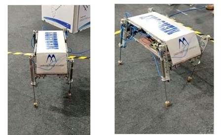

# Bachelor-Thesis
## Controlled Motion of a Pneumatic Quadruped Robot 
This project involves the design, control, and testing of a pneumatic quadruped robot developed in collaboration with Mercury Pneumatic Pvt. Ltd. The robot features two active degrees of freedom per leg and implements walking and pronking gaits using custom C++ control algorithms. The study evaluates robot dynamics and controllability, with a focus on seamless hardware integration, including a customized PCB design.


## Model Design
  

## Actual Robot
  

## Custom PCB Layout


## Code  
- Walking Gaits: [`codes/4 legged walking/main.c`](codes/4%20legged%20walking/main.c)  
- Trotting Gaits: [`codes/4 legged walking/main.c`](codes/4%20legged%20walking/main.c)

## Project Details
```
University: University of Mumbai  
Degree: Bachelors in Technology  
Department: Electronics and Telecommunication Engineering  
College: K. J. Somaiya College of Engineering, Mumbai-77  (Autonomous College Affiliated to University of Mumbai)  
Batch: 2016 - 2020  

Thesis Title: Controlled Motion of Four-Legged Robot

Authors: 
- Sahil Rajpurkar (Roll No: 1613130)  
- Soofiyan Atar (Roll No: 1613002)  
- Shreyas Borse (Roll No: 1613061)  


Guide: Prof. Dr. Swati Mahajan  
```

## Citation

```bibtex
@misc{atar2021gaits,
  author       = {Soofiyan Atar, Adil Shaikh, Sahil Rajpurkar, Pragnesh Bhalala, Aniket Desai, Irfan Siddavatam},
  title        = {Gaits Stability Analysis for a Pneumatic Quadruped Robot Using Reinforcement Learning},
  howpublished = {\url{https://publications.waset.org/10012112 gaits-stability-analysis-for-a-pneumatic-quadruped-robot-using-reinforcement-learning}},
  year         = {2021},
  note         = {Presented at the World Academy of Science, Engineering and Technology, International Journal of Industrial and Manufacturing Engineering, Vol. 15, No. 9}
}
```
## 
© 2020 Sahil Rajpurkar, Soofiyan Atar, Shreyas Borse All rights reserved.

*Submitted in partial fulfillment of the requirements for the degree of Bachelors in Technology.*
